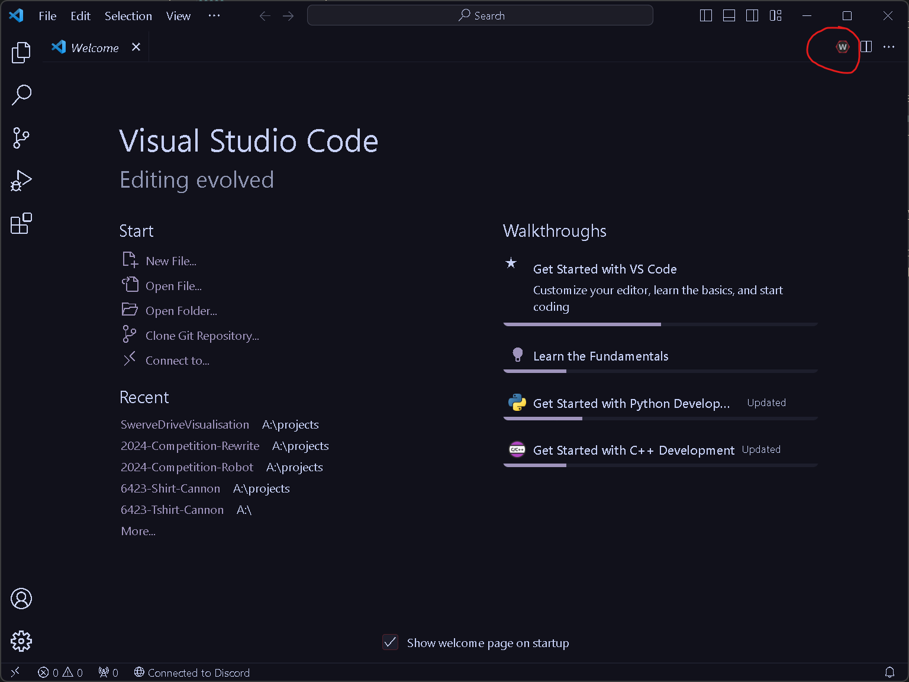
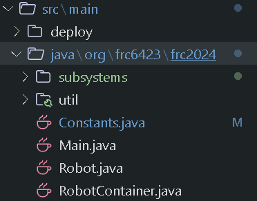
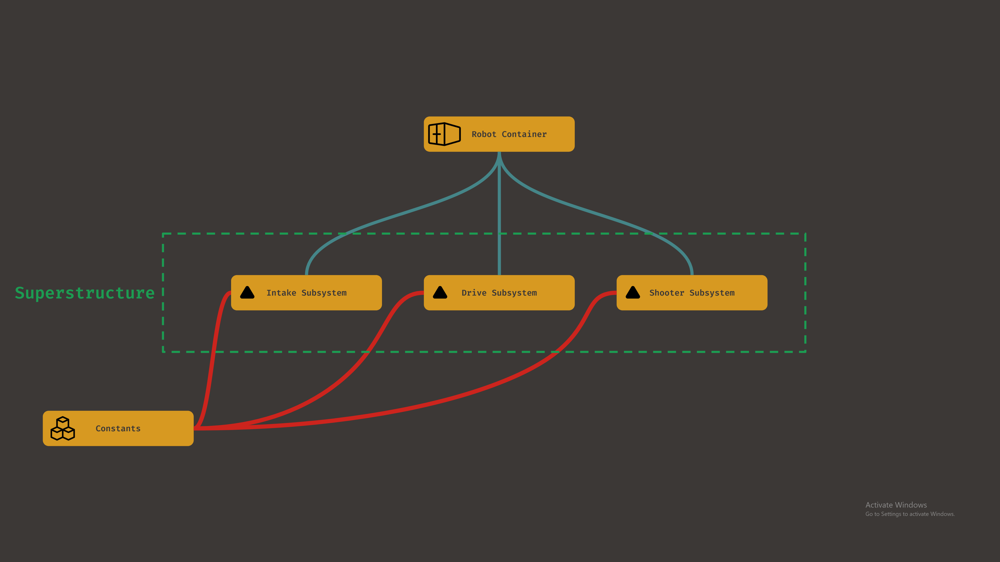

## A general introduction to WPIlib Programming and the Architecture of our codebase
That's a mouthful

#### Table of Contents
* Overview of WPIlib VScode

### Overview of WPIlib VScode
When you installed WPIlib on your computer, it setup a special version of VScode on your computer made for FRC programming. This app is typically called WPIlib VScode on your computer. If you already have VScode on your computer, this won't affect your existing version and will not have the extensions you have on it. WPIlib VScode has special commands that you can search through by using this button. For more experienced VSCode users, this is accessible through the command pallet.

There are many commands that you can find here, including commands to deploy your code to your robot, create robot code projects, simulate code, etc.

### Architecture
In order to write good code, you need to understand the architecture of our codebase. The architecture of our code refers to how it's organized.

If you look in the [src (source code)](https://github.com/FIRSTTeam6423/2024-Competition-Rewrite/tree/Swerve-Rewrite/src/main/java/org/frc6423/frc2024) folder of our robot, you'll see something like this

The way these classes work together is represented in the diagram below

