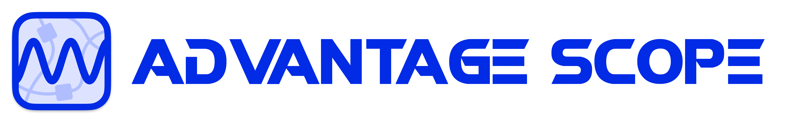

## Installing software

### Installing WPIlib
On our robot we have hardware such as motors, sensors, cameras, LEDs, etc. It can be complicated to write low level code for our hardware. This is why we use WPIlib.

WPIlib is an open source library that allows FRC teams to focus more on game specific control logic rather than the low level hardware logic.

We also use vendor specific libraries for vendor specific hardware. For instance, we use the REVlib for our REV hardware such as NEO motors and Spark Maxes.

Here's a link to the documentation of WPIlib. Read through the installation guide and contact me if you need help.

* https://docs.wpilib.org/en/stable/docs/zero-to-robot/step-2/wpilib-setup.html

### Other Programs
Advantage Scope (not to be confused with advantage kit) is a software that's helpful for debugging your code and replaying hardware inputs. We will be using it throughout the season, so download and install it.

* https://docs.advantagescope.org/
 

The FRC game tools allow you to actually run code on the robot using your laptop. You aren't required to install this, but if you intend to actually use your laptop to test things during the meeting you should install this. The game tools are only supported on windows laptops. If you're running a computer with MacOS or Linux, there are alternatives that you can find online but I do not recommend you use them. 

* [install the game tools](https://docs.wpilib.org/en/stable/docs/zero-to-robot/step-2/frc-game-tools.html)

# Once you finish this, try out the first [exercise](../Tutorials/Tutorial-01/Index.md)