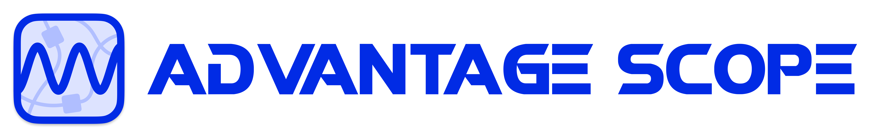

## Installation

Lets install everything you'll need

### WPIlib (Required)

An important library that handles low level hardware interactions. You can follow this guide to install it
* https://docs.wpilib.org/en/stable/docs/zero-to-robot/step-2/wpilib-setup.html

### Git (Required)

Versioning software that we use. Git is a CLI software, meaning you have to know terminal commands to use this. While this might seem unappealing, I find it to be easier and simple to use. However, if you're more comfortable using an app for this, you may use github desktop
* https://git-scm.com/downloads
* https://desktop.github.com/download/

### Game Tools (Optional)

Required if you want to actually run code from your laptop. You can only install this on windows. If you want to run code but you have a different operating system, DM me. 
###### (You also need to create an NI account to download this)
* https://www.ni.com/en/support/downloads/drivers/download.frc-game-tools.html#553883

### Advantage Scope (Optional but recomended lols)

Debugging software used for watching robot replays and visualizing simulations. You can install it here:
* https://github.com/Mechanical-Advantage/AdvantageScope/releases/tag/v4.1.0

# Next: [An Introduction to WPIlib](./wpilibIntro.md)