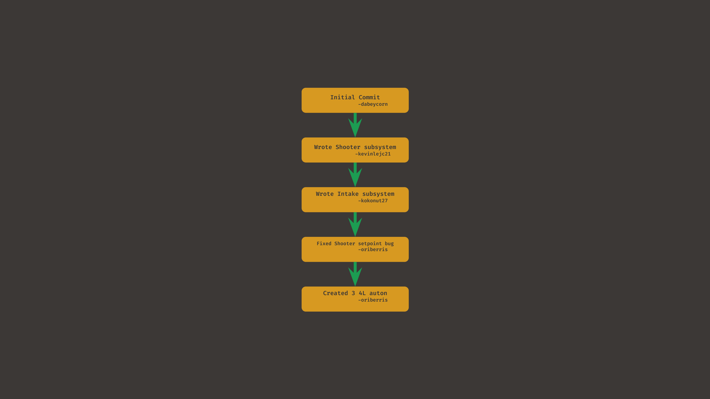
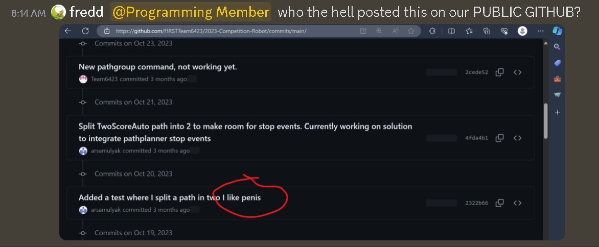
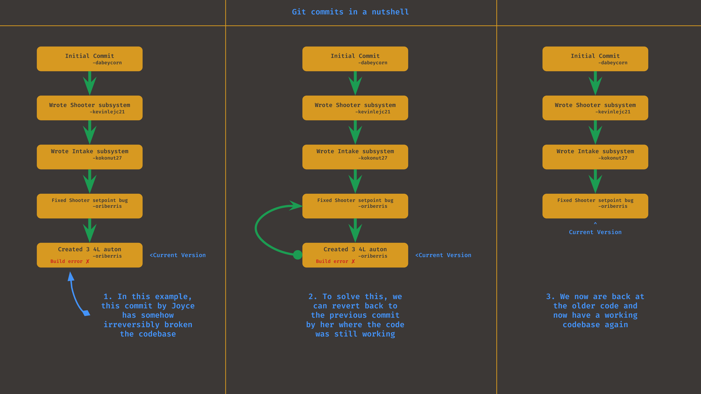
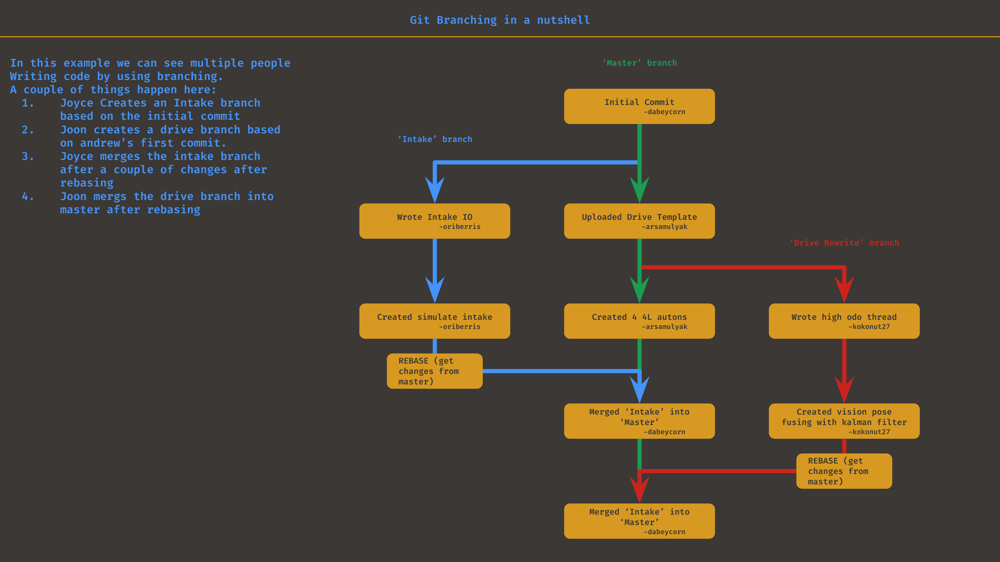
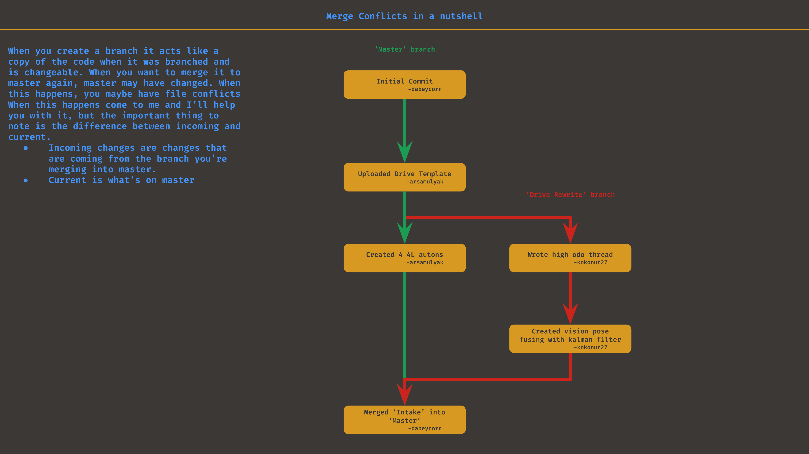

## Git Basics
git - the stupid content tracker

Git is a versioning tool that allows us to keep track of changes in our code

Say you changed something and your code stopped working, you could go back in time to your code before the change.

Or maybe you want to look at older code that was deleted to figure something out. You can view older versions using git.

Git also allows for easy collaboration with branching.

### The main parts of git
---
#### __Commits__
Commits are when you log changes. Say you created a file or modified an existing and you want to note its creation/changes. You can make a commit in git to note it's creation.

Commits consist of 3 things
* A message
* A description (optional)
* An author

Lets look at an example git timeline



Here you can see each commit and the respected author of each commit.

Commits usally don't have descriptions unless their commits with many changes

Remember, commit messages should be short and descriptive

Commits messages should consist of something vulgar.

Other teams can read our commit history, don't be stupid



#### __Reverting and viewing commits__
You can look through older commits and view them. Not only that, but if you wish to you may revert back to them. Consider the image below



#### __Branching, merging, PRs, and CRs__
When many people are working on the same code, you want to prevent people from breaking the code of others. When the season goes, the team will be interacting with the same files a lot. To prevent conflicts we use branches.

Lets say that Joyce is assigned to work on the Intake subsystem, while Joon is assigned a drive rewrite. Your git tree could look something like this



Branching essentially creates a copy of the code when the branch is created. This code can be edited without changing the 'master' code. When you're ready to merge your code, you create something called a 'pull request.' This can be thought of as a request to merge your code with the 'master' code. It can only be approved by software leads. You also need to create a code review on discord, which will be detailed more below.

###### __NOTE: when you work on a branch for a while, the code on 'master' might be heavily modified by the time you want to merge. This means files you worked on might have new changes to them, meaning you would have to deal with a merge conflict. This is something that you will need help with when you first see one, so make sure to talk to a lead about this__


If you want to read and understand more about git and branching with git, you can read the more detailed (and complex) git reference manual.
* https://git-scm.com/docs/user-manual 

### Actual Commands 
---
!TODO add github desktop instructions
You do not have to remember these, however you will be using these commands while writing code.

#### __Authing git__
Follow this tutorial to auth git
https://mgimond.github.io/Colby-summer-git-workshop-2021/authenticating-with-github.html

#### __Cloning Code__
The code exists on github, we want to download it on to your computer
you use git clone for this. Once you have the repo link, the command looks like this

```bash
# Replace this url with whatevs
git clone https://github.com/FIRSTTeam6423/CompetitionRewrite2024.git
```

#### __Pulling code__
Your downloaded code will not automatically update from github
you need to pull your code if you want to see changes that were uploaded

```bash
git pull
```

#### __Commits__
```bash
# Selects all changed files
git add --all
# Commits selected files with a commit message
# Your account will automatically 
git commit -m "Commit message"
```

#### __Viewing branches__
```bash
# Gets all branches from github
git fetch
# Opens branchName
git checkout branchName
# Creates branch called wahWah based on the branch you're currently on
git branch wahWah
# See what branch you're on
git branch
```

#### __Pushing Changes__
```bash
git push
# if you have merge conflicts it won't do it and it'll spew out a lot of text
# tell me if that happens
```

# Next: Exercise 1