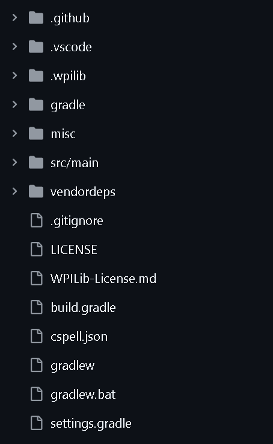
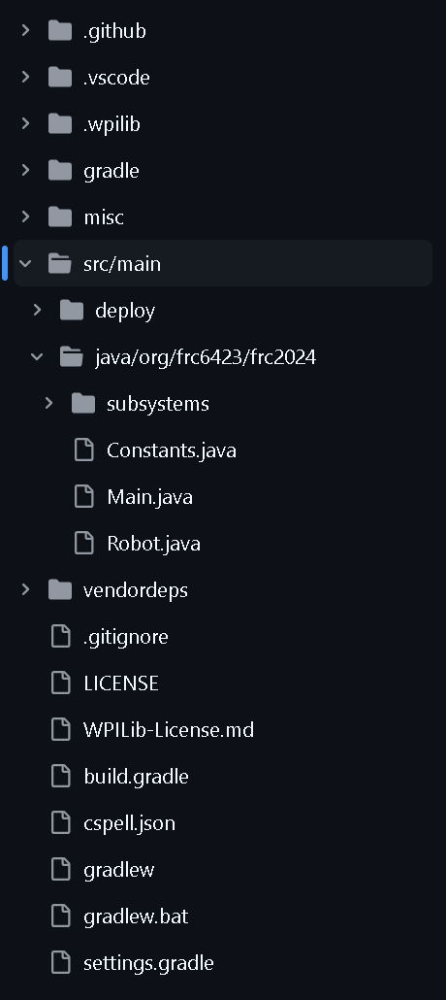
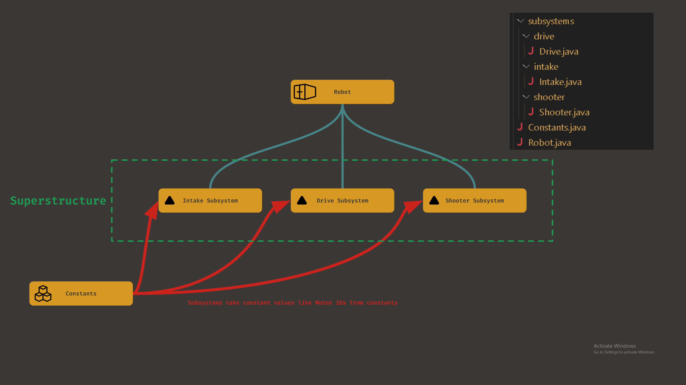

## An Introduction to WPIlib
###### Note: YOU ARE NOT EXPECTED TO MEMORIZE THIS, This is only supposed to get you thinking like a good FRC programmer
###### Sit down with some coffee, this is a big read

WPIlib is a general purpose FRC library that allows FRC teams to focus on game specific code without worrying about hardware details.

On your average robot you have electrical components that allows it to function, such as motors, power regulators, cameras, gyros, etc. It can be difficult to interface with these parts. WPIlib is an open source library that abstracts this 'lower level' code and allows us to focus on writing robot control logic.

Since we get our components from vendors such as REV (supplies us with things like the NEO motors) and CTR (supplies us with things like kraken motors), we use their own libraries with WPIlib. These are commonly refered to as [Vendor Deps](https://docs.wpilib.org/en/stable/docs/software/frc-glossary.html).

<!-- Another thing to note is that WPIlib is documented extensivly and the majority of FRC uses it. There are tons of resources out there that can help you with learning concepts. Here are some great resources you can use to learn WPIlib more.
* https://docs.wpilib.org/en/stable/index.html (The official WPIlib docs)
* [Team 8033's 2024 codebase](https://github.com/HighlanderRobotics/Crescendo)
* [Team 6328's 2024 codebase](https://github.com/Mechanical-Advantage/RobotCode2024)
* [Lyssia's Prog Server (A discord FRC programming server)](https://discord.gg/cuyFyFEw)
###### Note that you should think before you post on FRC social media
###### Note that other teams may do things differently than we do; our code shouldn't look exactly the same -->

### General Code structure
---
You should understand how our code is structured before you continue. If you look at one of our repositories you'll see something like this:



The actual code in any wpilib project lies in the `src` directory (a directory is a folder). The rest of the folders here are used to compile our code. The actual code is in here



#### __What do these files mean?__
Great question, here's a quick diagram and rundown



* `Robot.java` Wraps the whole thing together, takes actions from subsystems and binds them to controller
* `Intake.java, Drive.java, & Shooter.java` Subsystems; Parts of the robot
* `Constants.java` Holds values that don't change, motor IDs. If you have a value you use in a lot of places and change a lot, you put it here.

It can be hard to grasp your head around this, but as you read more and program more you'll understand it better.

### Subsystem Class
---
The entirety of your FRC robot (often refered to as the superstructure) contains things called subsystems. These are groups of components that work together to do something. Some examples of subsystems on our 2024 & 2023 robot:
* The shooter subsystem (2024); has 2 motors running at high speeds
* The climber subsystem (2024); has 2 motors running the climber up and down
* The arm subsystem (2023); has one motor controlling the entire pivoting arm (yikes)

These can be compared to a human, where the robot is the body and the subsystems are the parts that compose the body

Here's an example subsystem file, aka a subsystem class 
```Java
// Climber.java
public class Climber extends SubsystemBase {

    // This is the constructor
    // code in here runs when
    // you initalize this subsystem
    public Climber() {
        ...
    }

    // * ----- METHODS -----
    // Under this line, you have methods
    // Methods are code snippets that
    // run when called. These are
    // also known as functions

    // A getter for climber height
    public double getClimberHeight() {
        ...
    }

    // A setter for climber voltage
    public void runClimberVolts(double volts) {
        ...
    }

}
```
##### __Constructor__
The constructor is where you initalize all hardware and global variables
Here's how you would setup the climber motor object
```Java

// We put an m_ at the start of hardware objects and global variables in here
private final SparkMax m_climberMotor;

public Climber() {
    // kClimberMotor is from Constants
    m_climberMotor = new SparkMax(kClimberMotor, MotorType.kBrushless);
}

```

##### __Methods__
Methods are snippets of code that run when called. These are also called functions

There are two types of methods that you need to take note of:
* `Getters` These get a value and return it. you usally call this when you want to give the value to a variable, like `double currentClimberHeight = Climber.getClimberHeight();`
* `Setters` These are when you want to set a value in the subsystem. In this case, we set the voltage input for the climber motor

methods belong to the class where it's definined in

you can run a method like this
```Java

// A method for climber voltage
public void runClimberVolts(double volts) {
    ...
}

// If you're inside the subsystem class that owns the method, you call it like this
runClimberVolts(10);

// If you're inside a different subsystem class or Robot class, you call it like this
climber.runClimberVolts();
```
If you don't know java well this may seem confusing, but you'll understand this concept more as you go through the exercises 

### Robot Class
---
Here's an example of the Robot class.
```Java
// Climber.java
public class Robot extends LoggedRobot {

    // Creates new climber object
    private final Climber climber;

    // Robot constructor; runs when robot turns on
    public Robot() {   
        // initalizes climber subsystem
        climber = new Climber();

        // Runs when robot boots
        climber.runClimberVolts(10);
    }

}
```
Every subsystem must be initalized like this

### Command Based programming
---
Commands Based programming is a programming architecture created by WPIlib. It exists for teams to write more efficient and safe code. 

The subsystems of our robot are the 'nouns' of our robot, what it is. If they are nouns, Commands are the 'verbs' of our robot. The actions it can take. Each command can use multiple subsystems. If I had a command that shot a note while the robot was climbing, I could combine a command that shoots a note and a command that climbs up to make a new one. Subsystems can only be used by one command at a time, preventing subsystems from trying to do two things at the same time. This is why commands are safe, they prevent things like 2 bits of code trying to make the motor go in different directions at the same time

#### __Creating Commands in code__
The two main types of Commands that you need to remember are `run` commands and `runOnce` commands.
* The `run` command runs over and over until it get interrupted
* The `runOnce` command runs once and stops
```java
// Runs shooter wheels forever
Commands.run(() -> shooter.runFlywheels(), shooter);

// Will retract the arm. Once the command finishes, it won't do anything else
Commands.runOnce(() -> arm.retract(), arm);
```

The anatomy of a command is outlined below

```java
/** 
 * Argument 1
 *  '() -> shooter.runFlywheels()'
 *  This is something called a "lambda", you don't need to understand what
 *  it is, just know that if you want to put code into a command (in this
 *  case, a function/method) you would put '() -> function'
 * Argument 2
 *  'shooter'
 *  This argument takes in the subsystems that this command uses. In this
 *  case we use the shooter subsystem, so we add it as a requirement
*/
Commands.run(() -> shooter.runFlywheels(), shooter);

/** Here's an example of a Command that just has code inside of it */
Commands.runOnce(() -> {
    System.out.println("Hello World");
});
```

If you're inside a subsystem you can create a command like this

```java
public void retractArm() {
    ...
}

// Notice how you use 'this' instead of 'Commands'
// and you do 'retractArm()' instead of 
// 'arm.retractArm()'
this.runOnce(() -> retractArm());
```

#### __Using Commands__
To actually run a command we use triggers. A trigger can be thought of something that can be triggered. For example: a button press or a sensor detecting certain conditions. 

```Java
/** This is a command method;
 *  a way to define a command
 *  that we can use many times
*/
public Command shooterRunCmd() {
    return Commands.run(
        () -> shooter.runFlywheels(), 
        shooter
    );
}

// When the 'a' button on the controller is held down,
// the flywheels will run. When the button is let go,
// the flywheels will stop
controller.a().whenPressed(ShooterRunCmd());
```

#### __Command composing__
Combining commands is a useful concept. We can chain commands into groups to compose different commands. We uses decorators to chain commands.

```java
Command.decorator(OtherCommand);

// Retracts the arm; runOnce Cmd
public Command armRetractCmd() {
    ...
}

// Exploads robot; runOnce Cmd
public Command robotExploadCmd() {
    ...
}

// Will retract the arm. 
// Once retracted
// robot will expload
armRetractCmd()
    .andThen(robotExploadCmd());
```
###### Note: In this case the starting command is `armRetractCmd()` 

Common decorators
* `andThen(otherCommand)` After the starting command finishes, otherCommand runs
* `until(booleanCondition)` will run until condition is met
* `alongWith(otherCommand)` runs both starting command and otherCommand at the same time
* `withTimeout(timeInSec)` starting command runs until certain time passes
* `raceWith(otherCommand)` like `alongWith` however, when one command finishes it terminates the other command

Here are some cool complex groups
```Java

/** Run Intake */
public Command intakeRunCmd() {
return intake
    .deployIntakeCmd()
    .andThen(intake.resetIntakeCmd());
}

/** Spits out note */
public Command intakeSpitCmd() {
    return intake
        .noteSpitCmd()
        .andThen(intake.resetIntakeCmd());
}

```
Here are some resources if you want to learn more
* https://docs.wpilib.org/en/stable/docs/software/commandbased/index.html
DM me with any questions

# That was a lot, take a break and continue later lol
# Next: Exercise 1 (coming soon)
