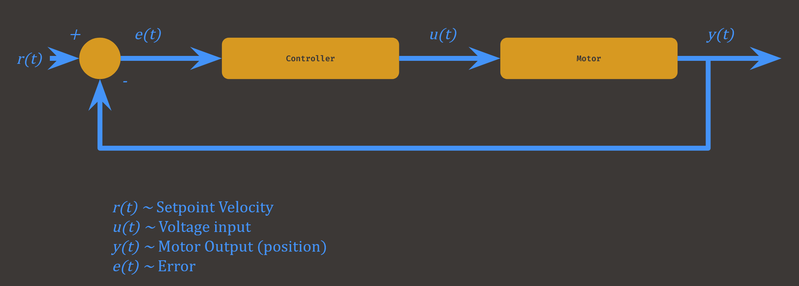

## Control Systems Intro

Controls system are a wildly complicated topic. They're so complicated, that they have their own engineering field, control engineering. Since we program robots, we do have to deal with control systems; However, you don't need a crazy understanding of the entire field. You only need a couple of bits and pieces.

A "Control system" is basically multiple electrionic devices that regulate other devices or system using control loops. These are real things, they're moe like computerized concepts. Think about it this way: a motor that controls a robot arm is unable to move by itself. First off there needs to be actual input; a control that moves it maybe. Then there needs to be something that actually controls the voltage to a motor, like a motor controller. But the system also needs to be able to tell the position of the arm, most likely through an absolute encoder. All of these components are part of a single system that controls the arm. This is just a single example of a control system.

Control systems exist all around us. Your computer's cooling system is a control system. Your air conditioning unit is a control system. Your heater? A control system.

### Control methods
Lets go back to the robot arm example for a second: how do I get the arm to move at precise positions? 

Well assuming I know what motor is driving the arm, I could just calculate how long I would have to run voltage to the motor to get it at the position. This is called 'open loop control' (aka, feedforward control). We just calculate the voltage based on motor constants. In a perfect world this would be the solution.

###### Diagram if you want, dw if you don't understand it

But there is a problem with this solution: our world isn't perfect.

Because there are factors that will prevent the arm from actually reaching the desired position here. Gravity, air resistance, robot momentum, robot acceleration; All of these factors will act against the arm. This is 'error,' something feedforward control is unable to account for. Therefore, feedforward isn't the best option for precise mechanisms such as an arm. 

If we wanted to control something like a flywheel (Really fast spinning wheel used to shoot things), feedforward control would be fine (We don't need to hit 5k rpm, we only need the speed to be around that) 

We want our robot to be precise, but error skews it. Therefore we need control that accounts for error. Low-and-behold: 'closed loop control' (aka feedback control). This method does the same thing as feedforward control, however it records error and uses it to recalculates motor input. Feedback control is much better for precise mechanisms like our arm

###### Diagram if you want, dw if you don't understand it

### The PID Controller
A PID controller is a simple feedback controller that is usable for many types of mechanisms
Some common uses of PID control:
* Moving an arm to a desired position
* Running a motor at a desired velocity
* Controlling the temperature in a room

A PID controller has 3 main constants
* The Proportional Constant (p)
* The Integral Constant (I)
* The Derivative Constant (D)

Each of these constants are plugged into the PID equation to give us movement that is responsive and accurate. We'll talk more about tuning a PID controller later. 

## Next: [Motion Profiling](./MotionProfiling.md)