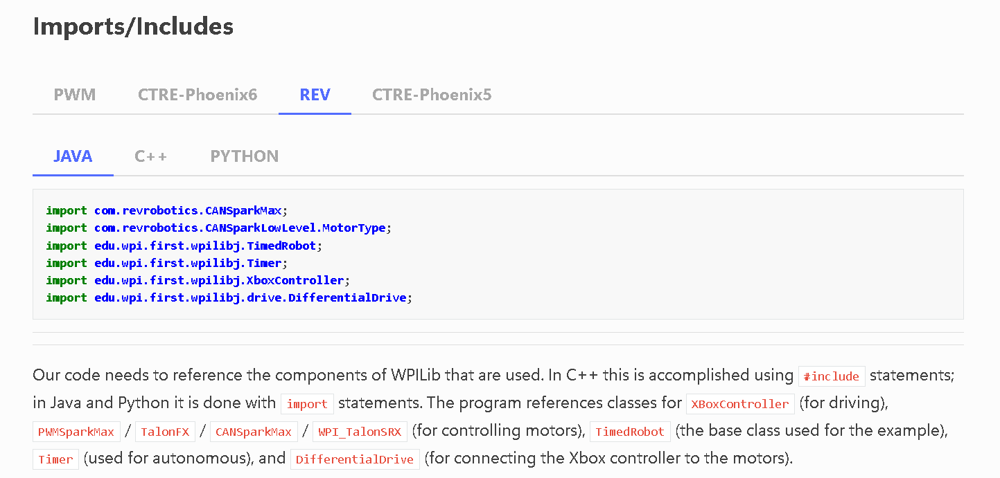

## A general introduction to WPIlib Programming

To get a general feel of how WPIlib works, you should start off by going through this 'zero to robot' guide
* [WPILib's zero to robot programming guide](https://docs.wpilib.org/en/stable/docs/zero-to-robot/step-4/creating-test-drivetrain-program-cpp-java-python.html)
    * We will be using rev for now, so make sure your on the REV tab while you go through the guide
  

Once you complete this guide, you'll have finished your first FRC code. Granted, this is an extremely simple project. If you're curious what more advanced projects look like, you can checkout [This tank drive example](https://github.com/FIRSTTeam6423/CompetitionRewrite2024/tree/tank-drive/src/main/java/org/frc6423/frc2024)

* Quick note: A lot of what WPILib does is "under the hood" to let us focus on high-level code rather than low-level hardware interface. This type of code is called the Hardware Abstraction Layer, or HAL

Once you go through this guide, you should read through 

# Next: [A guide to our Codebase Architecture](../arch/index.md)